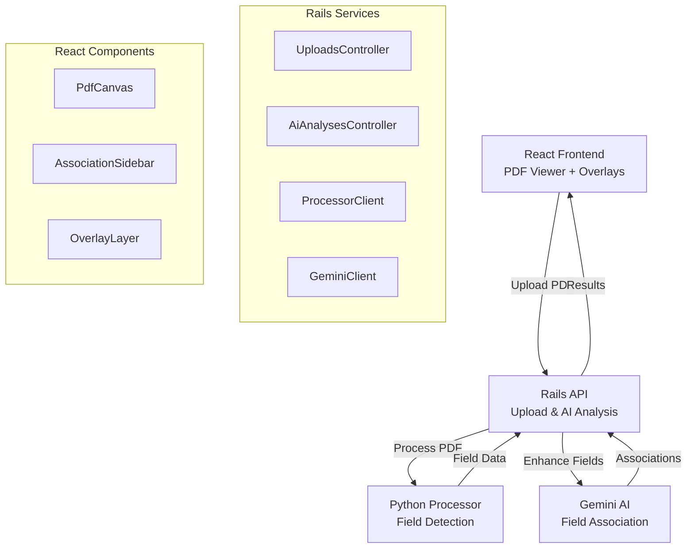

# Annot[AI]tor

AI-powered PDF form field detection and association system built with Rails API + React frontend.

## Architecture



## Quick Start

```bash
git clone <repo-url> annot-ai-tor && cd annot-ai-tor
cp .env.example .env && cp server/.env.example server/.env && cp client/.env.example client/.env.local
dev up
```

**React UI**: http://localhost:5173

## Core Features

- **PDF Upload & Processing**: Extract form fields using Python/Unstructured
- **AI Field Association**: Match labels to inputs using Gemini AI
- **Interactive Overlays**: Visual field highlighting on PDF
- **Real-time Analysis**: Toggle between raw detection and AI-enhanced results

## Stack

- **Backend**: Rails 7 API + MySQL 8 + Python Processor
- **Frontend**: React 18 + TypeScript + Vite + TanStack Query
- **AI**: Google Gemini 2.5 Pro for field association
- **Dev**: Docker Compose with unified dev commands

## Commands

```bash
# Services
dev up              # Start all services  
dev down            # Stop all services
dev test            # Run all tests

# Development
dev api.console     # Rails console
dev db.shell        # MySQL shell

# Service-specific (from server/ or client/)
dev start           # Start individual service
dev lint            # Run linters
dev test            # Run service tests
```

## API Endpoints

```
POST /api/v1/uploads        # Upload & process PDF
POST /api/v1/ai_analyses    # AI field association
GET  /api/v1/gemini-test    # Test AI connection
```

## Project Structure

```
server/             # Rails API
├── app/controllers/api/v1/
│   ├── uploads_controller.rb
│   └── ai_analyses_controller.rb
├── app/services/
│   ├── processor_client.rb
│   ├── gemini_client.rb
│   └── association_*.rb
└── config/routes.rb

client/             # React frontend
├── src/components/
│   ├── PdfCanvas.tsx
│   ├── AssociationSidebar.tsx
│   └── OverlayLayer.tsx
├── src/api/parseApi.ts
└── src/types/api.ts

processor/          # Python field detection
└── src/form_processor/
    ├── server.py
    └── extractor.py
```

## Environment Variables

```bash
# server/.env
GEMINI_API_KEY=your_gemini_api_key

# client/.env.local  
VITE_API_URL=http://localhost:3002/api/v1
```

## Cursor Rules

- **`.cursor/rules/rails_backend.mdc`** - Rails API best practices
- **`.cursor/rules/react_frontend.mdc`** - React/TypeScript frontend standards